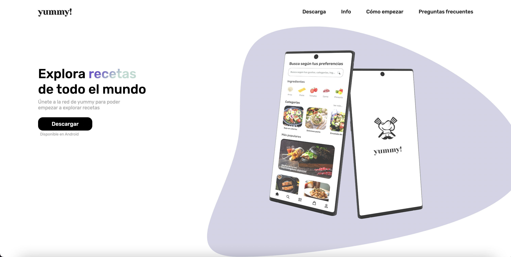
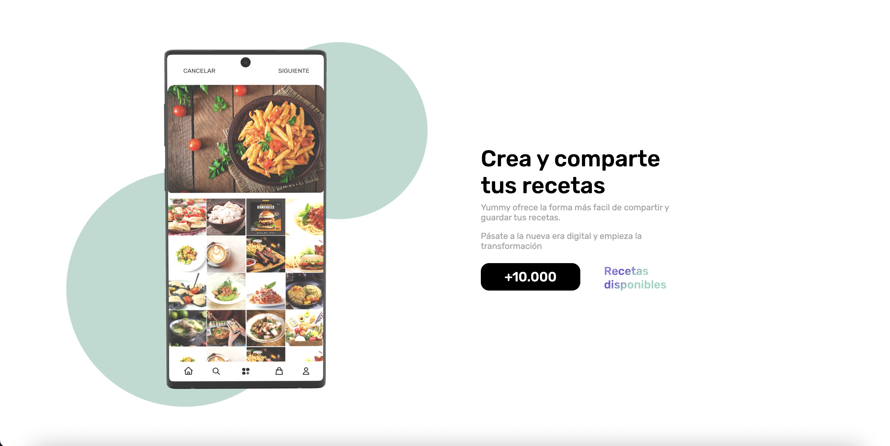
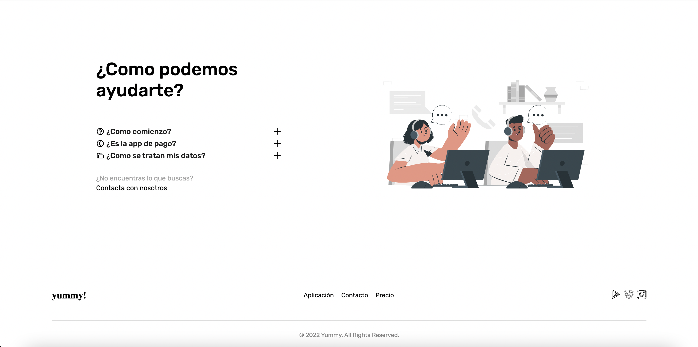
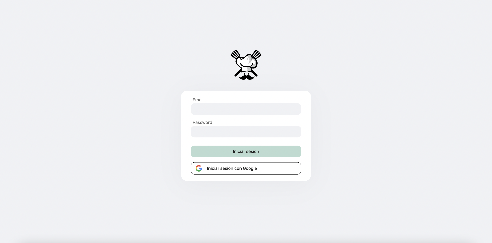
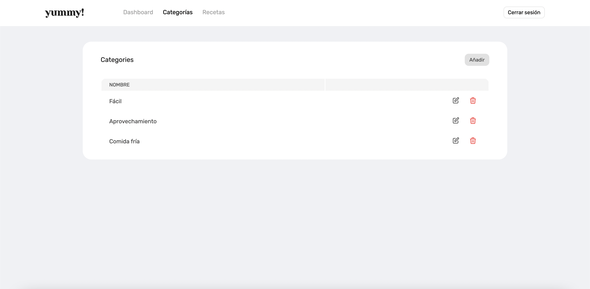

  <h2 align="center" margin-top="-40">YUMMY</h3>

 

## 👀 Qué es Yummy?
Yummy es una red social de recetas en la que podrás crear y compartir nuevas con tus amigos para satisfacer la necesidad de todos aquellos que necesitan ideas en el día a día para sus comidas. Yummy también incorpora una lista de compra para que no te olvides de echar al carro de la compra todo lo que necesites. Podrás guardar en favoritos las recetas que más te gusten para siempre tenerlas al alcance

------

## 📱 Plataformas 
Esta landing page está realizada para que se pueda ver en todos los dispositivos desde el navegador

## 🎮 Funcionamiento y maquetación
Diseño en [Figma](https://www.figma.com/file/lc6b9AhU2ySa6TzrixpCoE/YUMMY!?node-id=262%3A20)

### Diapositivas 

## 📄 Documentación PDF
Se puede descargar la documentación en pdf desde [aquí](https://github.com/gonzalosalmeron/yummy_angular/blob/main/src/assets/images/new/Yummy.pdf)

## 📚 Bibliografía
[StackOverflow](https://es.stackoverflow.com/)

## Otros repositorios
[Yummy App](https://github.com/gonzalosalmeron/yummy)
